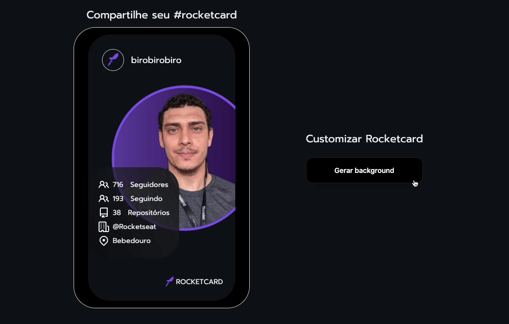

<h4 align="center"> 
	🚧 Rocket Card 🚀
</h4>

<p align="center" style="display: flex; align-items: flex-start; justify-content: center;">
  
</p>    

### 💻 Sobre o desafio 

Neste desafio você deverá desenvolver um card que traga as informações da API do Github e tenha um botão que altere a cor do fundo do card.

#### 💻 Techs

- Nível de dificuldade: Intermediário
- HTML
- CSS
- JavaScript

#### 💻 Como começar? 

1 - Use o link do [Figma](https://www.figma.com/file/xszb6WTlwCXWqE5jg4q2SO/DD-Rocketcard/duplicate)   como base para o projeto. Também disponibilizamos para download todos os assets necessários (imagens e ícones), para fazer o download basta clicar no link acima.  

2 - Leia com atenção todas as instruções do desafio.

3 - Bora codar! Lembre-se que você pode usar as tecnologias que se sentir mais confortável, mas também pode se desafiar usando novas techs, fazendo modificações e/ou adicionando funcionalidades no projeto como preferir. 🚀

4 - Compartilhe seu resultado ou tire suas dúvidas na nossa [**comunidade aberta**](https://discord.gg/bacwY2gDCF)  

### 💡 Conteúdos Aplicados

Neste desafio você vai construir um card que altere as cores de fundo e tenha integração com a API do Github*.* Caso você ainda não tenha feito os cursos do Discover ou queira fazer uma revisão, segue abaixo uma lista dos cursos que podem te ajudar a resolver este desafio.

- [o-guia-estelar-de-html](https://app.rocketseat.com.br/discover/course/o-guia-estelar-de-html)

**Requisitos para o desafio:**

- Consumir API do Github;
- Ter um botão que altere a cor de fundo;

***Se desafie também:***

- Criando um botão para fazer o download do card;
- Copiar o card no `clipboard` ;
- Adicionando animação no card;

### ✅ **Requisitos**

 

#### ✅ **[Requisitos](https://efficient-sloth-d85.notion.site/Desafio-Rocketcard-0d3572ef941f4a88889191773fe61c44#a37db0b5c5fa456fad709625adb06dd1)**
 
- [ ] estrutura do html

### ✅ Próximos passos

- [ ] responsividade
- [ ] responsividade das imagens 
- [ ] perfect pixel

### 🎨 Style Guide

#### 🎨 Cores
 
```css
:root {
  --bg: #000000;
  --bg-card: #0E1218;
  --text: #F1F1F1;
  --img-profile: #8257e5;
  --buttons: #FFF;
  --border-button: #1A1A1A;
}
```

#### 🎨 Fontes

- [ ] inserir as variáveis de [Google Fonts](https://fonts.google.com/)
- font-family: Prompt 
- Font Weight: 100, 400 e 700
 
### 📅 Entrega

A ideia é dominar o processo e o fluxo de desenvolver projetos e por isso, listados e descritos as tarefas em readme.

#### 📅 Gestão do projeto

- [ ] Organizando os detalhes do projeto no readme.md
- [ ] Uma branch main e uma developer, uma branch para cada tarefa
- [ ] Favicon

#### 📅 Aperfeiçoar em detalhes

- [ ] [Learn Responsive Design](https://web.dev/learn/design/)
- [ ] [Learn CSS](https://web.dev/learn/css/)

#### 📅 Telas Finais

- Desktop

<p align="center" style="display: flex; align-items: flex-start; justify-content: center;">
    
</p>  

- Mobile

<p align="center" style="display: flex; align-items: flex-start; justify-content: center;">
   
</p>  

Feito com ❤️ por Douglas A B Novato. 👋🏽 [Entre em contato!](https://www.linkedin.com/in/douglasabnovato/)
 
Fonte do projeto na [Rocketseat](https://www.rocketseat.com.br/). 👋 Participe da [comunidade aberta](https://discord.gg/bacwY2gDCF)!